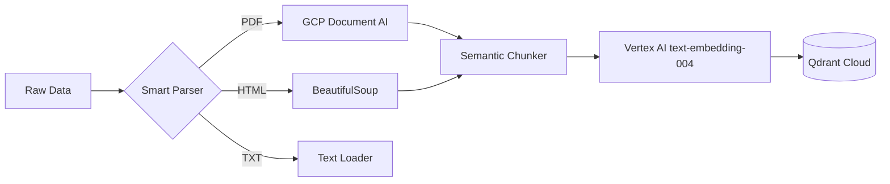

# 📥 Ingestion Engine: Data to Knowledge

The Ingestion Engine is a modular, high-performance pipeline designed to convert raw enterprise data into a searchable vector format.

## 🔄 The Pipeline Flow


---

## 🛠️ Technical Specifications

### 1. Smart Parsing (Cloud-First)
We offload the heaviest work to Google Cloud to keep our local containers slim and fast:
*   **PDFs (Document AI)**: Processed via **GCP Document AI**. This handles complex layouts, multi-column text, and OCR (Optical Character Recognition) for scanned files.
    *   *Enterprise Logic*: Document AI has a strict 15-page limit for synchronous API calls. Our pipeline automatically intercepts PDFs larger than 15 pages, slices them into 15-page chunks in memory (using `pypdf`), streams them to Google concurrently, and stitches the text back together. This completely bypasses the limit without manual intervention.
*   **HTML**: Processed via **BeautifulSoup**. It intelligently strips out `<script>`, `<style>`, and metadata tags to extract only the readable content.
*   **Office Docs**: Supports `.docx` and `.pptx` via the `unstructured` engine.

### 2. Semantic Chunking
*   **Chunk Size**: `1500` characters.
*   **Overlap**: Natural overlap (we split by paragraph breaks `\n\n` rather than arbitrary character counts).
*   **Logic**: The system uses a semantic-ish, paragraph-aware splitter. It attempts to keep paragraphs together to maintain context, ensuring that no chunk is cut off mid-sentence whenever possible. This prevents the LLM from getting "hallucinated" fragments.

### 3. Vectorization & Storage
*   **Embedding Model**: `text-embedding-004` (Google Vertex AI). This is a state-of-the-art embedding model specifically tuned for retrieval tasks.
*   **Vector Dimensions**: `768` dimensions.
*   **Vector Database**: **Qdrant**. We use a Cloud-hosted Qdrant instance for low-latency retrieval.
*   **Distance Metric**: **Cosine Similarity** (`models.Distance.COSINE`) is used to measure how closely a user query matches our document chunks.

---

## 🌍 Universal Ingestion Command
The engine is "Universal," meaning it automatically detects folder structures and maps them to metadata (e.g., "True" vs "Noisy" data).

```powershell
# Command to run the full ingestion
python -m app.ingestion.processor DATA --wipe
```
