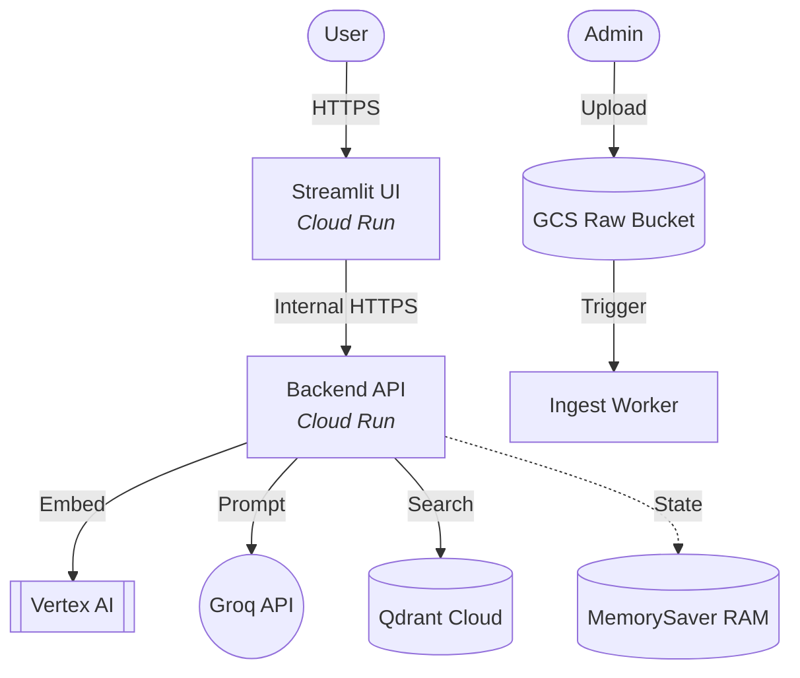

# ☁️ Infrastructure Architecture

This project is built on a **3-Tier Cloud Architecture** designed to separate the concerns of User Interaction, Intelligence, and Data.

---

## 🏗️ The Architectural Blueprint

---

## 🚀 Key Design Principles

### 1. Serverless Scaling
The entire compute tier (UI, API, Ingestion) is hosted on **Cloud Run**. This means you only pay when someone is using the app. It can handle 1 user or 1,000 users without manual server management.

### 2. High-Speed Local State
For rapid prototyping and development, we use **LangGraph MemorySaver**. This stores the conversation state directly in memory, ensuring zero latency and zero cost for managing state.

### 3. Decoupled Ingestion
The **Ingest Worker** is separate from the **API**. This ensures that processing massive document folders doesn't slow down the chat experience for users.

### 4. Zero-Trust Security
The architecture is designed to support **VPC Connectors**, allowing the system to communicate with private Google services securely without touching the public internet.
