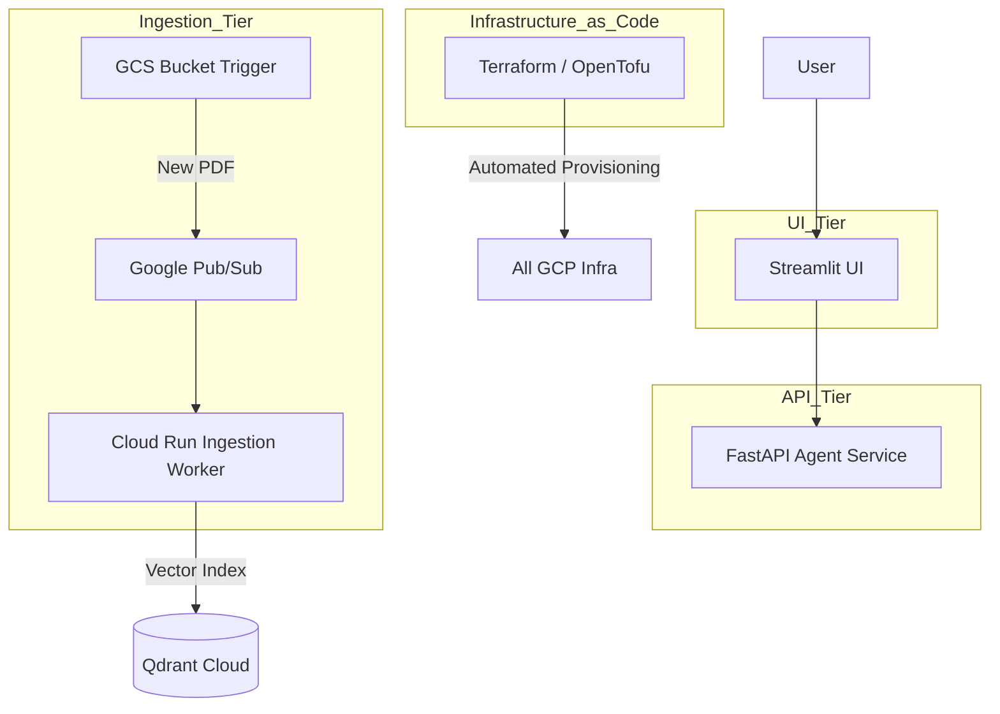

# Transition to Microservices & Infrastructure as Code (IaC)

This document outlines the limitations of our current "Monolithic" RAG architecture and provides a roadmap for transitioning to a scalable, event-driven microservices architecture managed by Terraform.

---

## 🛑 Current Architecture Limitations

While our current system is production-grade, it follows a **Monolithic Deployment** pattern where the UI, API, and Ingestion logic are tightly coupled.

### 1. Manual & Blocking Data Ingestion
*   **Drawback**: Ingestion is triggered manually via CLI scripts. This is not scalable for enterprise environments where thousands of documents arrive at random times.
*   **Impact**: Data freshness is delayed, and developers must manually manage the ingestion lifecycle.

### 2. Resource Contention
*   **Drawback**: The same Cloud Run service handles both user queries (fast) and document processing (slow/heavy). 
*   **Impact**: During heavy ingestion, user chat performance (latency) may suffer as the CPU and RAM are consumed by parsing and embedding tasks.

### 3. Manual Infrastructure Management
*   **Drawback**: Every GCS bucket, IAM role, and VPC connector was created via manual `gcloud` commands or the console.
*   **Impact**: This is error-prone, difficult to replicate in a "Staging" vs "Production" environment, and hard to track over time.

---

## 🏗️ Future State: Microservices Architecture

In the next phase, we will decouple the system into independent, specialized services.

### Proposed Flow

---

## 🚀 Key Transition Pillars

### 1. Event-Driven Ingestion (Eventarc + Pub/Sub)
Instead of running a script, we will use **Google Eventarc**:
1.  **GCS Upload**: User drops a PDF into a bucket.
2.  **Eventarc Trigger**: Eventarc detects the file and immediately sends a notification.
3.  **Automatic Ingestion**: A dedicated Cloud Run **Ingestion Worker** is triggered to parse and index the file instantly.

### 2. Infrastructure as Code (Terraform)
We will define the entire environment (GCS, VPC, Cloud Run, SQL) in Terraform:
*   **Automatic Provisioning**: Run `terraform apply` to build the entire 3-tier RAG stack in minutes.
*   **Total Lifecycle Control**: Run `terraform destroy` to safely tear down all resources when not in use, ensuring no accidental GCP costs.

### 3. Postgres Persistent History
We will migrate from the in-memory `MemorySaver` to a **Postgres Checkpointer**:
*   **Why**: Current memory is wiped if the container restarts. 
*   **Solution**: By using our Cloud SQL (Postgres) instance, user chat history becomes **permanent** and survives server restarts, deployments, and crashes.

### 4. Specialized Scaling
*   **UI Service**: Scales based on web traffic.
*   **API Service**: Scales based on query volume (CPU optimized).
*   **Ingestion Worker**: Scales based on the number of documents in the queue (Memory optimized).

---

## 🏁 Summary of Benefits

| Feature | Current (Monolith) | Future (Microservices) |
| :--- | :--- | :--- |
| **Ingestion** | Manual / Script-based | Fully Automated (Event-driven) |
| **Scaling** | All-or-nothing | Per-service scaling |
| **Provisioning** | Manual `gcloud` commands | **Terraform (Automated)** |
| **Reliability** | Single point of failure | Isolated failures (UI stays up if Ingestion fails) |

This transition will move the project from a "Scale Test" to a **Global-Scale Document Intelligence Platform.**
