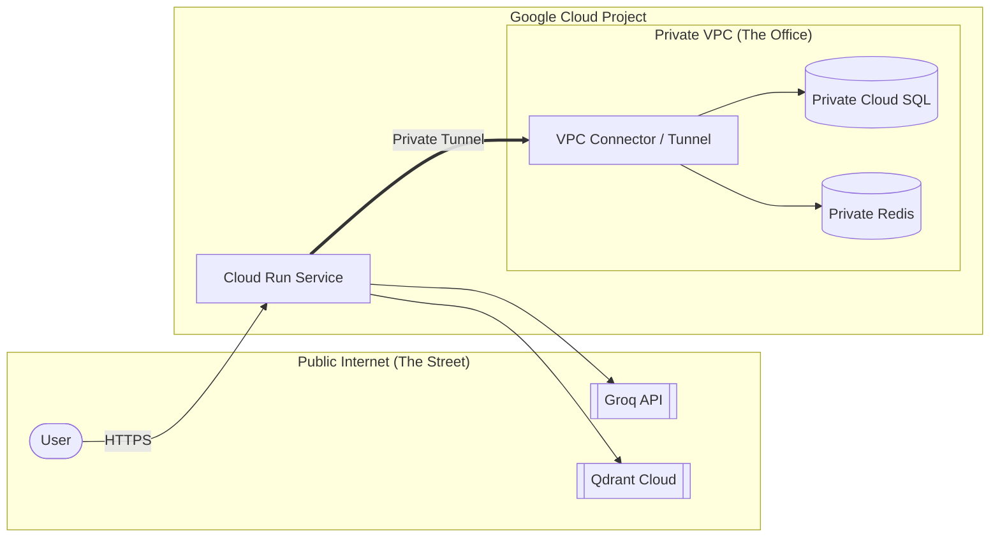

# 🔒 VPC Networking: Street vs. Private Office

This document explains the networking architecture of the project in simple terms, focusing on the **VPC (Virtual Private Cloud)** and the **VPC Connector**.

---

## 🏙️ The "Street" vs. The "Office"

To understand cloud networking, imagine this scenario:

1.  **The Public Internet (The Street)**: This is a public space. Anyone can see you, and anyone can try to talk to you.
2.  **The VPC (Your Private Office)**: This is a locked building that you own. Only your invited "employees" (services) are allowed inside.
3.  **Cloud Run (The Employee)**: This is your application code running in a container.

### The Problem
By default, **Cloud Run** lives on the "Street." It can talk to anyone on the internet (like Groq or Qdrant Cloud) very easily. 

However, your **Cloud SQL Database** or **Redis Cache** lives inside your **Private Office (VPC)**. They are locked away so that hackers on the "Street" cannot even find them. Because Cloud Run is on the street and the Database is in the office, they cannot talk to each other.

---

## 🚇 The Solution: The VPC Connector (The Tunnel)

The **VPC Connector** is like a **Private Tunnel** that connects the Street directly into your Office.

When we deploy Cloud Run with the `--vpc-connector` flag, we are giving our container a "Key" to that tunnel. It allows the container to reach into the private VPC and talk to the database securely, without ever having to step out into the public internet.

### Network Flow Diagram



---

## 🛡️ Why do we use this?

1.  **Zero-Trust Security**: Your database doesn't need a public IP address. It is invisible to the entire world except for your Cloud Run service.
2.  **Data Residency**: Your data stays within Google's internal private fiber network. It never touches the public internet "cables."
3.  **Performance**: Internal VPC communication is often faster and has lower latency than going through public gateways.

---

## 💡 Pro-Tip for Students
Even if your app doesn't use a database *today*, building the VPC and the Connector now is a "Future-Proofing" step. It means you can scale from a simple memory-based app to a massive persistent database app just by changing a single line of code!
---

## 🏗️ Creating the Tunnel: Command Breakdown

To build the tunnel, we run this command:

```powershell
gcloud compute networks vpc-access connectors create rag-vps \
    --region us-central1 \
    --network default \
    --range 10.8.0.0/28
```

### Why this command?
*   **`rag-vps`**: This is the name of your tunnel. Note: GCP only allows hyphens (`-`), not underscores (`_`).
*   **`--network default`**: This tells the tunnel which "Private Office" (VPC) it should lead to.
*   **`--range 10.8.0.0/28`**: This is the **most important part**. It is the "Internal ID" or "Phone Number" of the tunnel.

---

## ⚠️ The "IP Range Conflict" Rule

When creating a VPC Connector, you must provide a **CIDR range** (like `10.8.0.0/28`). Think of this as the **private lane** on a highway reserved strictly for this tunnel.

### Why do we have to change the range for a new connector?
If you try to create a second connector (e.g., `rag-vps-2`) using the **same** range (`10.8.0.0/28`), Google Cloud will throw an error: `Invalid IP CIDR range... it conflicts with an existing subnetwork.`

**In simple terms:** You cannot have two different tunnels trying to use the same "private lane" at the same time.

### How to fix it:
If you need to create a new connector because the first one is stuck or you want a different name, you **must increment the number**:
*   Connector 1: `10.8.0.0/28`
*   Connector 2: `10.9.0.0/28`
*   Connector 3: `10.10.0.0/28`

This ensures every tunnel has its own unique path into your private network!
