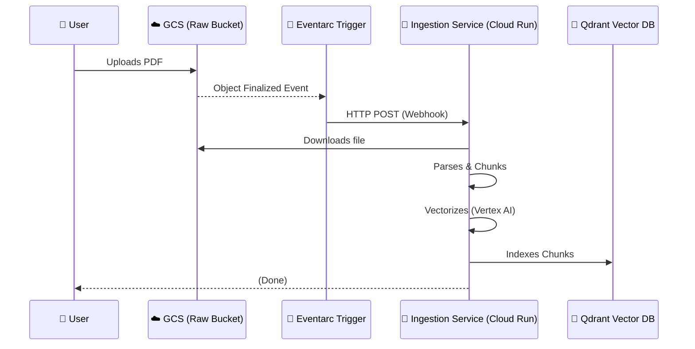

# ⚡ Step 3: Event-Driven Auto-Ingestion (Eventarc)

This phase transforms our ingestion process from a manual script into an automated, "always-on" cloud worker. 

## 🔄 The Automated Workflow
When a file is uploaded to Google Cloud Storage, it triggers a chain reaction:

---

## ⚠️ WARNING: The "Infinite Credit Loss" Bug
In event-driven architectures, there is a dangerous pitfall known as a **Feedback Loop**. 

### What is the bug?
If your code is configured to "watch" a bucket for new files, but then your code **writes a file back** to that same bucket, it triggers the event again. This creates a circle:
1. Upload -> Trigger Service
2. Service -> Uploads Log/File back to Bucket
3. Bucket -> Triggers Service (Again)
4. ...and so on, thousands of times a minute.

**The Result**: Your LLM credits and Cloud Run budget can be exhausted in a few hours.

### Our Solution
We have implemented **Loop-Proofing**:
*   **Logical Separation**: In "Cloud Mode," the service explicitly **skips** the upload-to-GCS step because it knows the file is already there.
*   **Bucket Isolation**: The service only watches the `RAW` bucket but writes results to the `PROCESSED` bucket.

---

## 🛠️ Code Implementation Details

1.  **FastAPI Webhook**: We've added a FastAPI listener to `processor.py`. Eventarc sends the JSON payload containing the bucket and filename to this endpoint.
2.  **Hybrid Logic**: The script detects if it is running as a CLI (Manual) or a Server (Webhook).
3.  **Deduplication Registry**: We check the database before processing to ensure we aren't indexing the same content multiple times.
