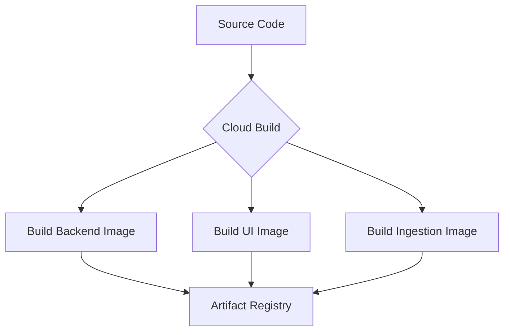

# 🧩 Doc 19: Microservices & Containerization

In this phase, we moved away from a "Monolith" (one big app) and embraced **Microservices**. This document explains why and how.

## 🏗️ What are Microservices?
Microservices is an architectural style where an application is structured as a collection of small, independent services. Each service runs its own process and communicates with others via HTTP APIs.

### Why do we need them?
1.  **Independent Scaling**: If 1,000 users are chatting but only 1 person is uploading a file, we can scale the `UI` and `Backend` services up while keeping the `Ingestion` service small.
2.  **Fault Isolation**: If the `Ingestion` service crashes because of a corrupted PDF, the `UI` and `Backend` remain live. The users can still chat!
3.  **Technology Flexibility**: We could theoretically write the UI in JavaScript and the Backend in Python, and they would still work together perfectly.

---

## 📦 The `docker/` Folder
To make microservices work, we use **Containers** (Docker). Think of a container as a "lightweight box" that contains the code, the libraries, and the OS settings needed to run that specific service.

*   **`backend.Dockerfile`**: Sets up the FastAPI environment + LangGraph agent.
*   **`ui.Dockerfile`**: Sets up the Streamlit interface.
*   **`ingestion.Dockerfile`**: Sets up the heavy document parsing libraries (`unstructured`, `poppler`, etc.).

---

## 🛠️ The `cloudbuild.yaml` File
Since we have three different services, building them manually one-by-one is tedious. `cloudbuild.yaml` is our **Automation Script** for Google Cloud Build.

When you run `gcloud builds submit --config cloudbuild.yaml .`, Google Cloud:
1.  Reads the `cloudbuild.yaml` file.
2.  Starts three parallel build processes.
3.  Pushes the resulting images to your **Artifact Registry**.
4.  Makes them ready for Cloud Run to deploy.

## 🚀 Summary
By using Microservices + Docker + Cloud Build, we have created a "Production-Grade" pipeline where our code is portable, scalable, and easy to manage.
