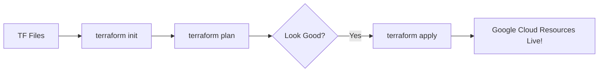
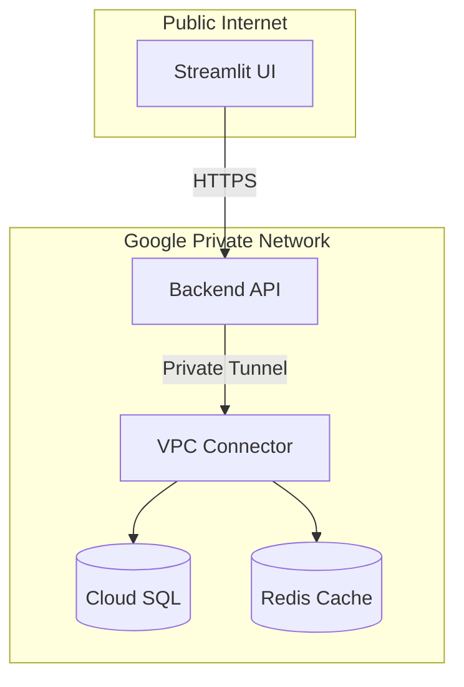

# 🏗️ Doc 20: Infrastructure as Code (Terraform)

As your application grows, you need more than just code; you need "Servers" (Cloud Run), "Databases" (Cloud SQL), and "Caches" (Redis). **Terraform** allows us to manage all of this using text files instead of clicking buttons in the Google Cloud Console.

## 🤖 What is Terraform?
Terraform is an **Infrastructure as Code (IaC)** tool. You describe your desired state (e.g., *"I want a Postgres database with 2GB RAM"*), and Terraform figures out how to make it happen.

### Why do we need it?
*   **Speed**: Setting up a VPC, Database, Redis, and 3 Cloud Run services takes ~30 minutes manually. Terraform does it in ~5 minutes.
*   **Consistency**: If you want to move your app from `us-central1` to `europe-west1`, you just change one line of code.
*   **Safety**: You can "Preview" changes before they happen using `terraform plan`.

---

## 📂 The `terraform/` Folder Breakdown

| File | Purpose |
| :--- | :--- |
| `main.tf` | The core. Defines the VPC (Networking), Redis (Cache), and GCS Buckets. |
| `database.tf` | Defines the Cloud SQL (PostgreSQL) instance and the `rag_admin` user. |
| `cloud_run.tf` | Defines the Backend and UI services. It connects them to the VPC and Database. |
| `ingestion.tf` | Defines the Ingestion service and the **Eventarc Trigger** logic. |
| `variables.tf` | The "Blueprint settings." Defines what inputs (Project ID, Region) are needed. |
| `terraform.tfvars` | **Your actual data.** Contains your secret API keys and project settings. |
| `provider.tf` | Tells Terraform to talk to the Google Cloud (GCP) plugin. |

---

## 🔄 The Infrastructure Workflow

## 🌐 Networking & Security
Terraform handles the complex "Serverless VPC Access." It creates a private "tunnel" (VPC Connector) so that your Cloud Run services can talk to the Database and Redis securely without going over the public internet.

## 🧹 Pre-Deployment Checklist (The "Clean Sweep")
Terraform works best on a blank canvas. Before your students run `terraform apply`, they should ensure these resources **do not already exist** manually in their GCP console:

*   **VPC Network**: `enterprise-rag-vpc`
*   **VPC Connector**: `rag-connector` (Found in Serverless VPC Access)
*   **Cloud SQL**: `enterprise-rag-db`
*   **Redis**: `enterprise-rag-cache`
*   **GCS Buckets**: `{project_id}-rag-raw` and `{project_id}-rag-processed`
*   **Artifact Registry**: `enterprise-rag-repo`

## 🚀 Summary
Terraform is the "Remote Control" for your Cloud. By keeping our infrastructure in code, we ensure that anyone can recreate this entire Enterprise system in minutes.
