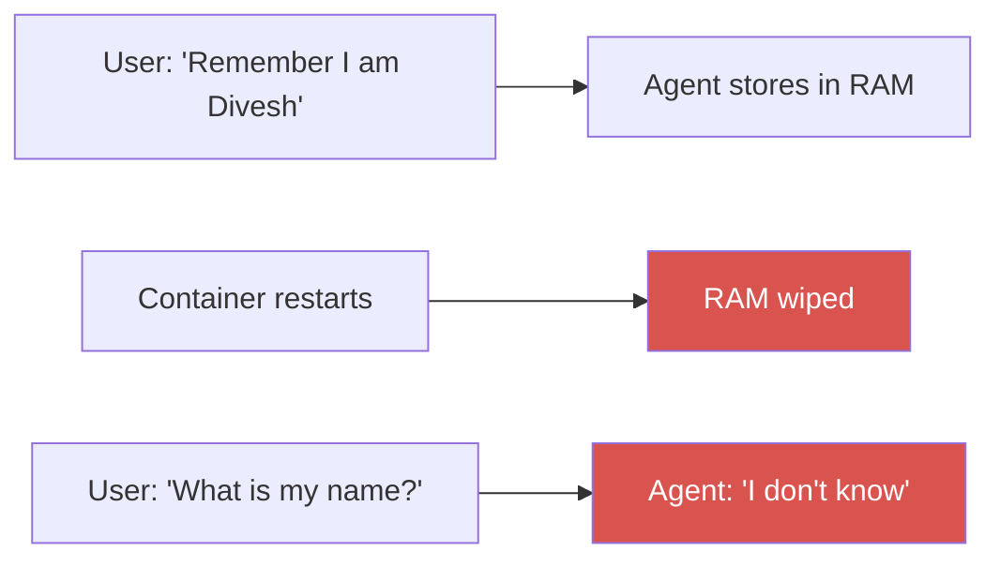
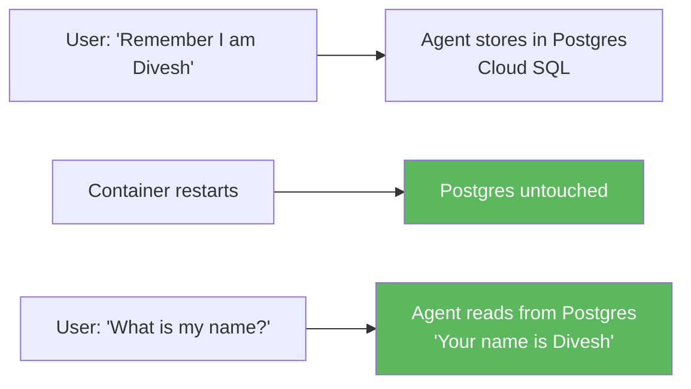
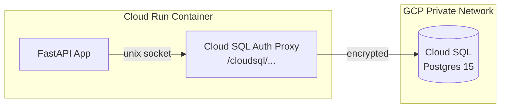

# Step 2: Persistent Agentic Memory (Postgres)

This phase upgrades the agent's memory. Instead of losing conversation history every time the container restarts, the agent stores all LangGraph checkpoints in a **PostgreSQL** database on Cloud SQL.

---

## The Problem with MemorySaver

`MemorySaver` stores conversation state in RAM. Cloud Run scales to zero — when the container restarts, all memory is gone. Users have to repeat context in every new session.



---

## The Solution: PostgresSaver

LangGraph's `PostgresSaver` writes every graph checkpoint to Postgres. Memory survives restarts, redeploys, and scaling events.



---

## Architecture

### Hybrid Mode — LOCAL_MODE Flag

```python
# app/agents/graph.py
def _build_checkpointer():
    if LOCAL_MODE:
        return MemorySaver()          # local dev — no DB needed
    pool = get_db_pool()
    if pool is None:
        return MemorySaver()          # fallback if DB unreachable
    checkpointer = PostgresSaver(pool)
    checkpointer.setup()              # creates LangGraph tables on first run
    return checkpointer
```

| `LOCAL_MODE` | Checkpointer | Use case |
|---|---|---|
| `true` | `MemorySaver` (RAM) | Local development — no DB needed |
| `false` | `PostgresSaver` (Cloud SQL) | Production — memory persists forever |

### Connection: psycopg3 Unix Socket

On Cloud Run, the connection uses a **Unix socket** (`/cloudsql/<connection_name>`) via the Cloud SQL Auth Proxy that's built into Cloud Run. No public IP, no extra library needed.

```python
# app/services/gcp/database_service.py
def get_db_pool():
    db_host = os.getenv("DB_HOST")  # "/cloudsql/dmtxpresss:us-central1:enterprise-rag-db"
    conninfo = f"host={db_host} dbname={db_name} user={db_user} password={db_pass}"
    return ConnectionPool(conninfo, min_size=1, max_size=5, open=True)
```



> **Why unix socket, not TCP?** The Cloud SQL Auth Proxy runs as a sidecar inside the Cloud Run container. Connecting via the socket file (`/cloudsql/...`) is faster, more secure, and doesn't require whitelisting any IP addresses.

---

## Security

- No public TCP access — `ip_configuration { ipv4_enabled = true }` with no `authorized_networks` means the public IP exists (required for the proxy) but no direct connections are allowed
- All traffic goes through the Cloud SQL Auth Proxy which uses IAM authentication
- Credentials never travel over the public internet

---

## Schema

`PostgresSaver.setup()` creates the LangGraph checkpoint tables automatically on first startup:

```sql
-- Created automatically by checkpointer.setup()
checkpoints          -- stores agent state per thread_id + checkpoint_id
checkpoint_blobs     -- stores serialized graph state
checkpoint_writes    -- stores pending writes
```

Each user conversation maps to a `thread_id`. The agent loads the latest checkpoint for that thread on every request.

---

## See Also

- `app/services/gcp/database_service.py` — connection pool
- `app/agents/graph.py` — `_build_checkpointer()`
- `terraform/database.tf` — Cloud SQL provisioning
- `DOCS/10_REDIS_CACHING.md` — Redis is for semantic caching, NOT conversation memory
