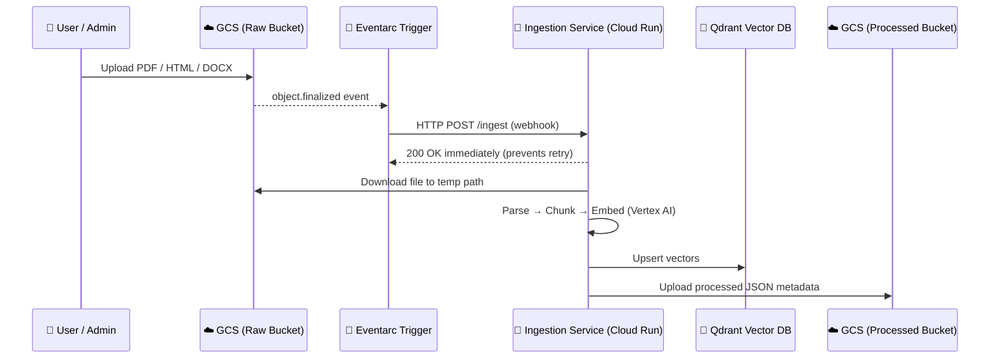
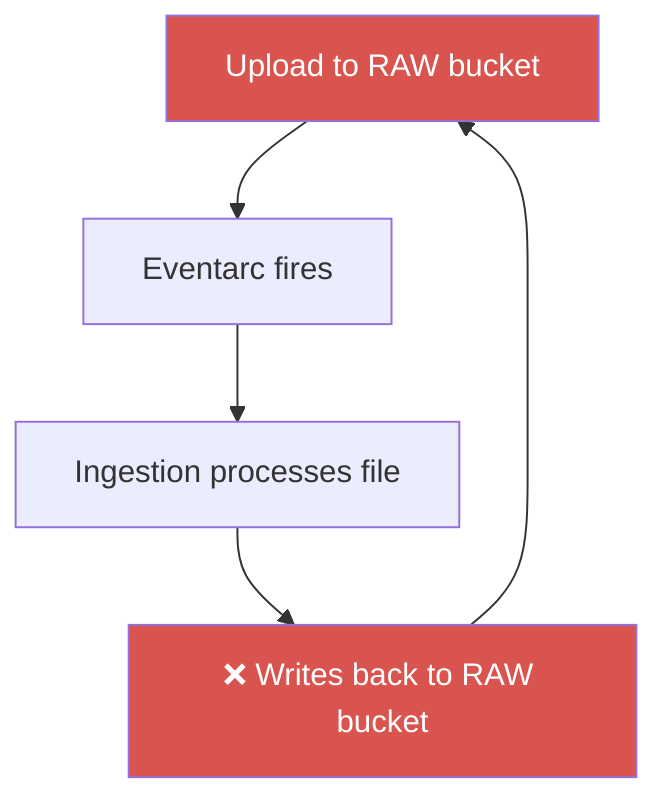
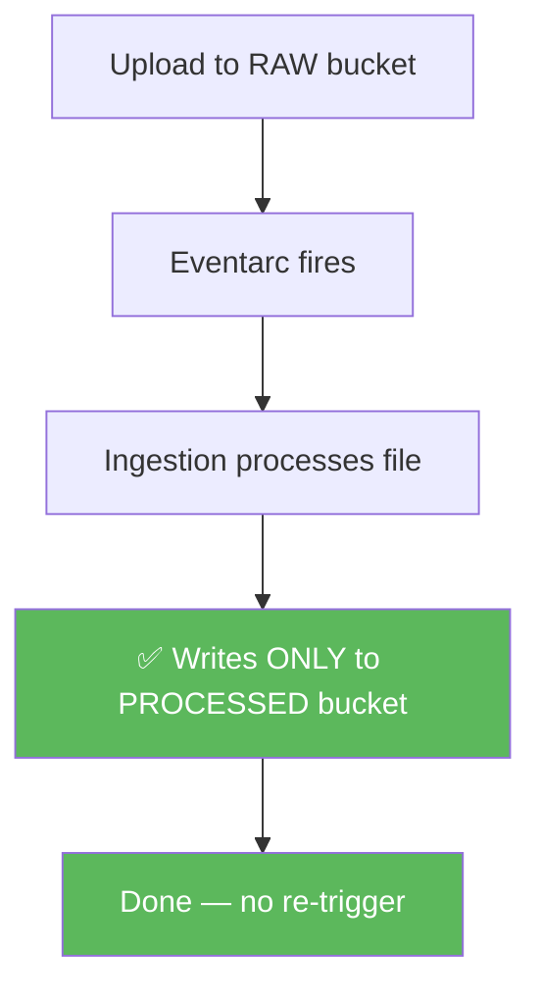

# Step 3: Event-Driven Auto-Ingestion (Eventarc)

This phase transforms data ingestion from a manual CLI script into an automated, always-on cloud worker.

---

## The Automated Workflow

When a file lands in the raw GCS bucket, it triggers a chain reaction:



> Returning `200 OK` immediately is critical — if Eventarc doesn't get a 200 within 10 seconds, it retries. The actual processing runs as a `BackgroundTask` after the response is sent.

---

## The Feedback Loop Bug (and How We Fixed It)

In event-driven architectures there is a dangerous pitfall: if the ingestion service writes back to the **same bucket** Eventarc is watching, it re-triggers itself infinitely.



**The result:** Thousands of invocations per hour, exhausting Cloud Run budget and LLM credits.

### Our Fix: Bucket Isolation + skip_raw_upload



Two guards are in place:

1. **`skip_raw_upload=True` in cloud mode** — the ingestion service never writes back to the RAW bucket. It downloads the file, processes it, and only writes metadata to the PROCESSED bucket.

2. **Bucket isolation** — Eventarc watches only the RAW bucket. The PROCESSED bucket has no trigger attached.

```python
# app/ingestion/processor.py
def process_file(file_path, filename, source_type, skip_raw_upload=False):
    if not skip_raw_upload:
        upload_to_gcs(file_path, settings.RAW_BUCKET, raw_gcs_path)  # CLI mode only
    # Steps 2–5 always run: parse → chunk → embed → index
    # Step 4 always writes to PROCESSED_BUCKET — safe, no trigger attached
```

---

## Dual Mode: CLI and Cloud

The same `processor.py` file handles both modes:

| Mode | Trigger | RAW Upload | Use Case |
|------|---------|-----------|---------|
| **CLI** | `python -m app.ingestion.processor DATA/` | ✅ Yes | Initial bulk load from local files |
| **Cloud** | Eventarc webhook → `/ingest` endpoint | ❌ Skipped | Ongoing automatic ingestion |

---

## IAM Requirements for Eventarc

Eventarc requires specific permissions to function. All of these are provisioned by Terraform:

| Service Account | Role | Why |
|---|---|---|
| GCS service agent | `roles/pubsub.publisher` | GCS publishes object events to Pub/Sub |
| Eventarc service agent | `roles/eventarc.serviceAgent` | Eventarc validates bucket existence and routes events |
| Ingestion SA | `roles/eventarc.eventReceiver` | Ingestion Cloud Run service can receive Eventarc events |
| Ingestion SA | `roles/storage.objectAdmin` | Download from RAW, upload to PROCESSED |

> **Terraform gotcha:** The Eventarc service agent SA (`service-{NUMBER}@gcp-sa-eventarc.iam.gserviceaccount.com`) is created asynchronously when `eventarc.googleapis.com` is enabled. A `time_sleep` resource of 30s in `main.tf` ensures it exists before Terraform tries to grant it the IAM role.

---

## See Also

- `app/ingestion/processor.py` — full dual-mode implementation
- `terraform/ingestion.tf` — Eventarc trigger + ingestion Cloud Run service
- `terraform/main.tf` — GCS service agent IAM + Eventarc service agent IAM
