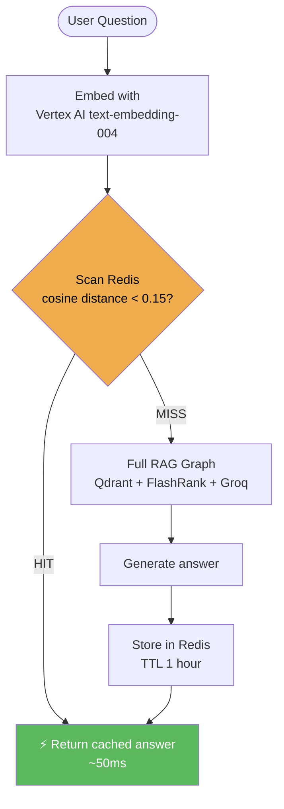

# Step 4: Semantic Caching with Redis

This step adds a high-performance caching layer. Instead of re-running the full RAG pipeline for similar questions, we use **vector similarity** to serve cached answers in ~50ms.

---

## Why Semantic Caching?

Traditional caches use exact string matching — useless for natural language:

| Query 1 | Query 2 | Exact cache | Semantic cache |
|---------|---------|-------------|----------------|
| "What is HPA?" | "What is Horizontal Pod Autoscaling?" | ❌ MISS | ✅ HIT |
| "How do CronJobs work?" | "Explain Kubernetes CronJobs" | ❌ MISS | ✅ HIT |
| "What is Redis?" | "How does Memorystore work?" | ❌ MISS | ✅ HIT |

The first time a question is asked, it goes through the full pipeline. Every similar question after that is instant.

---

## How It Works



### Implementation

We use **plain `redis-py`** with **`numpy` cosine similarity** — no extra libraries required:

```python
# app/services/gcp/redis_semantic_cache.py

DISTANCE_THRESHOLD = 0.15   # cosine distance — lower = stricter
CACHE_TTL          = 3600   # 1 hour TTL
KEY_PREFIX         = "sem_cache:"

def check_cache(query: str) -> str | None:
    query_embedding = embed_texts([query])[0]
    for key in redis_client.scan_iter(f"{KEY_PREFIX}*"):
        entry = json.loads(redis_client.get(key))
        distance = 1 - cosine_similarity(query_embedding, entry["embedding"])
        if distance < DISTANCE_THRESHOLD:
            return entry["answer"]   # Cache HIT — return immediately
    return None

def set_cache(query: str, answer: str) -> None:
    embedding = embed_texts([query])[0]
    key = f"{KEY_PREFIX}{uuid4()}"
    redis_client.setex(key, CACHE_TTL, json.dumps({
        "query": query, "answer": answer, "embedding": embedding
    }))
```

> **Why not `redisvl`?** The Redis Vector Library (`redisvl`) adds a dependency and requires a vector index to be created in Redis. For our cache size (typically < 1,000 entries), a simple `scan_iter` + numpy cosine check is faster to implement, more stable, and avoids the extra dependency entirely.

---

## Gate Position in the Pipeline

The semantic cache is Gate 2 in `app/main.py` — after guardrails, before the RAG graph:

```
Request → Gate 1: NeMo Guardrails → Gate 2: Semantic Cache → Gate 3: RAG Graph
```

This means:
- Blocked requests never reach the cache
- Cached answers skip the entire RAG graph (Qdrant, FlashRank, Groq)
- After a successful RAG response, the answer is stored for future cache hits

---

## Threshold Tuning

| Distance | Behaviour | Risk |
|----------|-----------|------|
| `0.10` | Very strict — only near-identical phrasings hit | Low cache hit rate |
| `0.15` | Recommended — catches paraphrases safely | Balanced |
| `0.25` | Loose — high hit rate | May return wrong cached answer for tangentially related questions |

---

## Business Impact

| Metric | Without Cache | With Cache (50% hit rate) |
|--------|--------------|--------------------------|
| Avg response time | ~4s | ~2s |
| Groq tokens per day | 100% | ~50% |
| Cost at scale | Linear with users | Sub-linear — plateaus as cache warms |
| Availability during LLM outage | 0% | Cached questions still work |

---

## See Also

- `app/services/gcp/redis_semantic_cache.py` — implementation
- `app/main.py` — gate integration
- `terraform/main.tf` — Redis Memorystore provisioning
- `DOCS/10_REDIS_CACHING.md` — implementation reference
