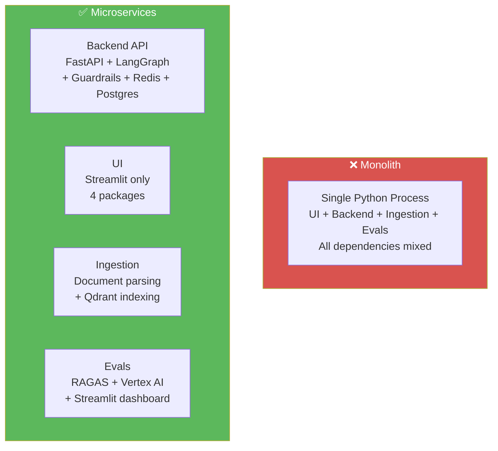
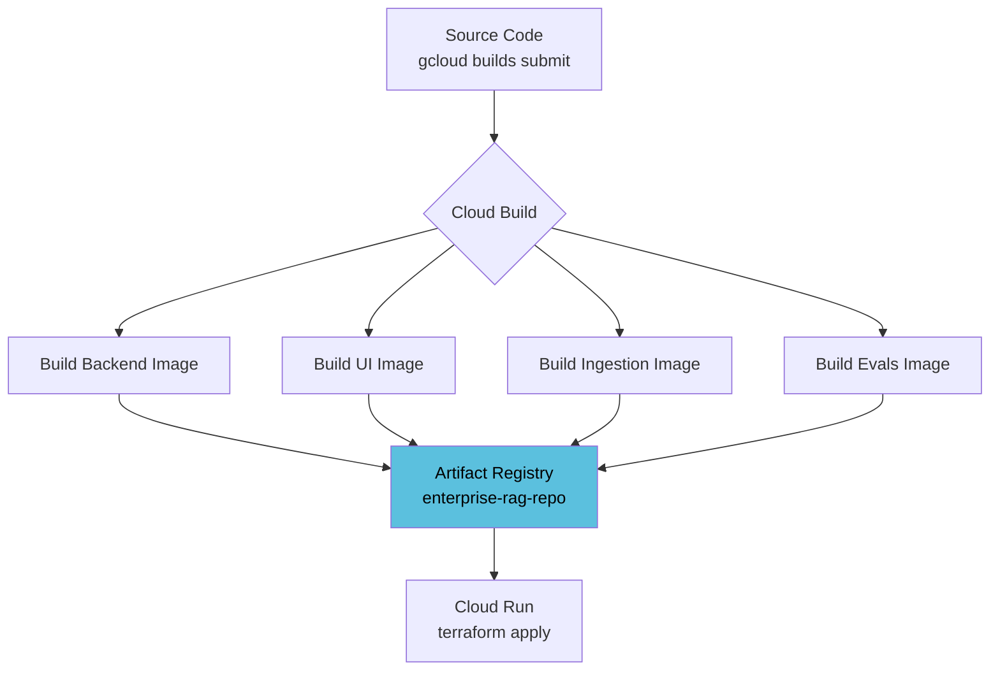

# Microservices & Containerization

This document explains the shift from a monolithic app to four independent, containerized microservices.

---

## What are Microservices?

Instead of one big application that does everything, we split into four focused services. Each runs in its own container, scales independently, and has its own dependencies.



### Why Split?

| Benefit | Example |
|---------|---------|
| **Independent scaling** | 1,000 users chatting but only 1 uploading — scale backend to 10 instances, ingestion stays at 1 |
| **Fault isolation** | Corrupted PDF crashes ingestion — UI and backend stay live |
| **Dependency isolation** | Evals needs RAGAS — backend doesn't. Without splitting, PyTorch bloats the backend image |
| **Independent deploys** | Fix the UI without redeploying the backend |

---

## The Four Services

| Service | Dockerfile | Port | Cloud Run | Purpose |
|---------|-----------|------|-----------|---------|
| **Backend** | `docker/backend.Dockerfile` | 8080 | Public | FastAPI + LangGraph agent + guardrails + Redis + Postgres |
| **UI** | `docker/ui.Dockerfile` | 8501 | Public | Streamlit chat interface |
| **Ingestion** | `docker/ingestion.Dockerfile` | 8080 | Internal only | Document parsing + Qdrant indexing (Eventarc webhook) |
| **Evals** | `docker/evals.Dockerfile` | 8080 | Public | RAGAS eval suite + history dashboard |

---

## Split Requirements Files

Each service has its own `requirements-*.txt` to keep images lean:

```
requirements-backend.txt     ← FastAPI, LangGraph, NeMo Guardrails, Redis, psycopg3
requirements-ui.txt          ← streamlit, requests, python-dotenv (4 packages only)
requirements-ingestion.txt   ← DocAI, Qdrant, unstructured, pypdf, python-docx
requirements-evals.txt       ← RAGAS, Vertex AI embeddings, Streamlit, pandas
```

> **No PyTorch anywhere.** Deepeval (which pulls PyTorch) was removed — Tool Correctness uses pure Jaccard math. All four images are lightweight.

---

## The `cloudbuild.yaml` — Building All Four



All four builds run in parallel. Subsequent builds reuse cached layers — only changed layers rebuild.

```bash
# From project root — builds all 4 images
gcloud builds submit --config cloudbuild.yaml --timeout=7200 .
```

---

## Docker Layer Caching Strategy

Each Dockerfile follows the same pattern to maximise cache hits:

```dockerfile
# ✅ Install deps FIRST (cached unless requirements change)
COPY requirements-backend.txt .
RUN pip install -r requirements-backend.txt

# Copy app code LAST (changes frequently, only this layer rebuilds)
COPY app/ ./app/
```

If only `app/main.py` changes, the `pip install` layer is reused from cache — rebuild takes seconds instead of minutes.

---

## See Also

- `docker/` — all four Dockerfiles
- `cloudbuild.yaml` — Cloud Build pipeline
- `terraform/cloud_run.tf` — Cloud Run service definitions
- `DOCS/24_INFRASTRUCTURE_AS_CODE_TERRAFORM.md` — Terraform overview
