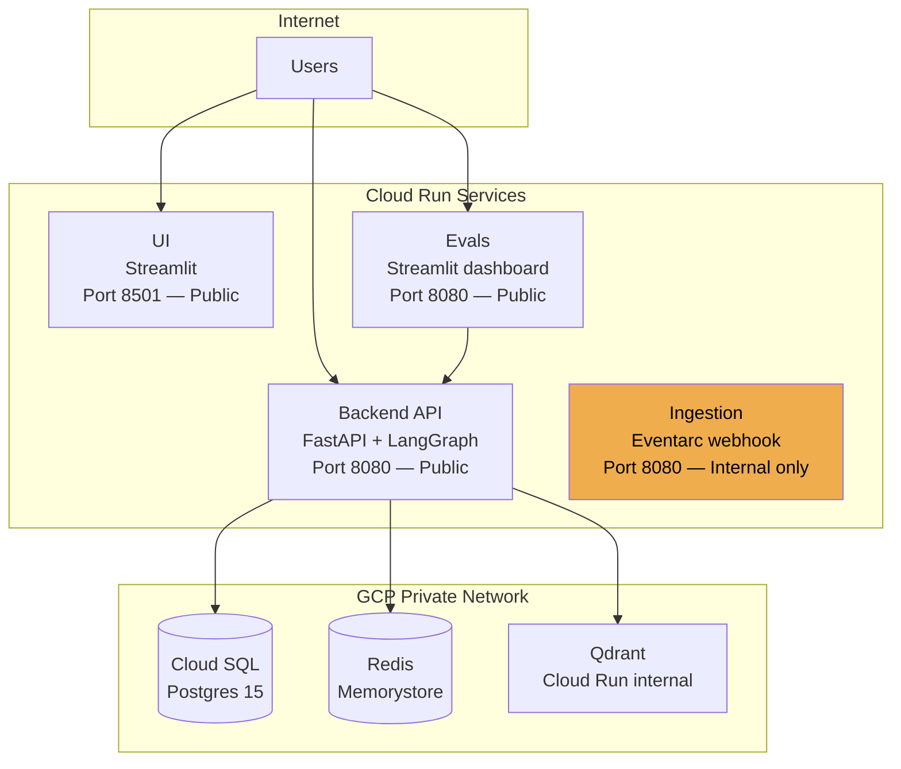
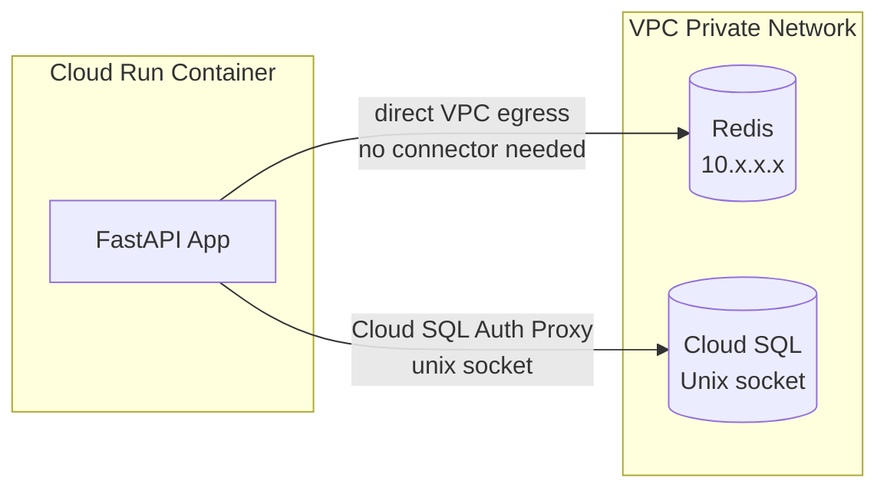
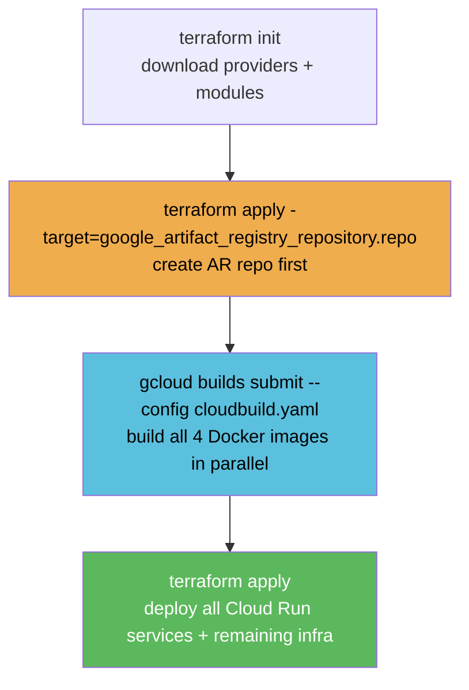

# Infrastructure as Code (Terraform)

Everything in GCP — Cloud Run services, Cloud SQL, Redis, Eventarc, GCS buckets, VPC, IAM — is defined as code in the `terraform/` directory and applied with `terraform apply`.

---

## Why Terraform?

| Without Terraform | With Terraform |
|---|---|
| Click through 15 GCP console screens | One command: `terraform apply` |
| Hard to reproduce in a new project or region | Change `var.region` and re-apply |
| No history of what changed when | Changes are tracked in version control |
| Drift between environments | State file enforces actual = desired |

---

## The `terraform/` File Breakdown

| File | What it defines |
|------|----------------|
| `main.tf` | VPC, GCS buckets (raw + processed), Eventarc service agent IAM, Redis Memorystore, time_sleep for SA race condition |
| `database.tf` | Cloud SQL (Postgres 15), `rag_admin` user, IAM binding for Cloud SQL client |
| `cloud_run.tf` | All four Cloud Run services (backend, ui, ingestion, evals) + public IAM |
| `ingestion.tf` | Eventarc trigger, ingestion service account IAM |
| `variables.tf` | Input variable declarations (project_id, region, api keys, etc.) |
| `terraform.tfvars` | Your actual secret values — **never commit this file** |
| `provider.tf` | GCP + hashicorp/time providers |
| `output.tf` | Prints backend_url, ui_url, evals_url, ingestion_url after apply |

---

## The Four Cloud Run Services



---

## Networking: Direct VPC Egress

Cloud Run services connect to Redis (private IP `10.x.x.x`) and Cloud SQL via **direct VPC egress** — not a VPC Connector. The `network_interfaces` block in `cloud_run.tf` attaches the container directly to the VPC:

```hcl
# cloud_run.tf — backend service
vpc_access {
  network_interfaces {
    network    = google_compute_network.vpc.name
    subnetwork = google_compute_subnetwork.subnet.name
  }
  egress = "ALL_TRAFFIC"
}
```



> There is **no VPC Connector** (`google_vpc_access_connector`) in this architecture. Direct VPC egress was introduced in Cloud Run gen2 and is faster and cheaper than the serverless VPC access connector.

---

## Cloud SQL Connection

The backend connects to Cloud SQL via a **Unix socket** — not TCP. The Cloud SQL Auth Proxy runs as a sidecar inside the Cloud Run container. The connection string looks like:

```
host=/cloudsql/dmtxpresss:us-central1:enterprise-rag-db dbname=... user=... password=...
```

No public TCP port is open. `ipv4_enabled = true` (required by GCP — the public IP exists but no `authorized_networks` are whitelisted, so no direct connections are possible).

---

## Eventarc Service Agent — Race Condition

When `eventarc.googleapis.com` is enabled via Terraform, GCP creates the Eventarc service agent SA **asynchronously**. If Terraform immediately tries to grant it `roles/eventarc.serviceAgent`, the SA may not exist yet and the IAM grant fails.

**Fix in `main.tf`:**

```hcl
resource "time_sleep" "wait_for_eventarc_sa" {
  create_duration = "30s"
  depends_on      = [google_project_service.services]
}

resource "google_project_iam_member" "eventarc_service_agent" {
  project    = var.project_id
  role       = "roles/eventarc.serviceAgent"
  member     = "serviceAccount:service-${data.google_project.project.number}@gcp-sa-eventarc.iam.gserviceaccount.com"
  depends_on = [time_sleep.wait_for_eventarc_sa]
}
```

The `hashicorp/time` provider is declared in `provider.tf` and downloaded on `terraform init`.

---

## Backend Scaling

The backend Cloud Run service has `min_instance_count = 1` to prevent cold starts for users:

```hcl
scaling {
  min_instance_count = 1
  max_instance_count = 10
}
```

This keeps one warm instance alive at all times. Other services scale to zero when idle.

---

## Deployment Workflow



> **Order matters:** The AR repo must exist before Cloud Build can push images to it. This is why the repo is applied first as a targeted apply, before the full `gcloud builds submit`.

---

## Pre-Deployment Checklist

Before running `terraform apply` in a fresh project, verify these resources do **not** already exist in GCP (Terraform will fail to create them if they do):

| Resource | GCP Console Location | Terraform name |
|---|---|---|
| VPC Network | VPC Networks | `rag-vpc` |
| Cloud SQL instance | Cloud SQL | `enterprise-rag-db` |
| Redis instance | Memorystore | `rag-cache` |
| GCS Buckets | Cloud Storage | `{project_id}-rag-raw`, `{project_id}-rag-processed` |
| Artifact Registry | Artifact Registry | `{app_name}-repo` |

> **Note:** Resource names use variables. `app_name` defaults to `enterprise-rag` in `variables.tf`. If you've already created any of these manually, either delete them first or import them into Terraform state with `terraform import`.

---

## Key Variables (`terraform.tfvars`)

```hcl
project_id   = "your-gcp-project-id"
region       = "us-central1"
app_name     = "enterprise-rag"

groq_api_key  = "gsk_..."
judge_groq    = "gsk_..."       # separate key for eval judge LLM
logfire_token = "..."
portkey_api_key = "..."
portkey_virtual_key = "..."
qdrant_url    = "https://..."
qdrant_api_key = "..."
db_password   = "..."
```

> **Never commit `terraform.tfvars`** — it contains API keys. It is listed in `.gitignore`. Students should copy `terraform.tfvars.example` and fill in their own values.

---

## Outputs

After `terraform apply`, the following URLs are printed:

```
backend_url   = "https://enterprise-rag-backend-xxxx-uc.a.run.app"
ui_url        = "https://enterprise-rag-ui-xxxx-uc.a.run.app"
evals_url     = "https://enterprise-rag-evals-xxxx-uc.a.run.app"
ingestion_url = "https://enterprise-rag-ingestion-xxxx-uc.a.run.app"
```

---

## See Also

- `terraform/` — all `.tf` files
- `cloudbuild.yaml` — parallel image builds
- `commands_scalable.md` — step-by-step deployment commands
- `DOCS/23_MICROSERVICES_AND_CONTAINERIZATION.md` — Docker layer caching strategy
- `DOCS/21_STEP_3_EVENTARC_INGESTION.md` — Eventarc IAM requirements
- `DOCS/20_STEP_2_POSTGRES_MEMORY.md` — Cloud SQL unix socket connection
