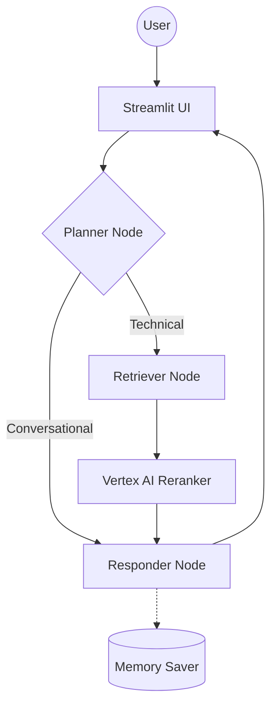

# 🏗️ 01. System Overview

This project implements a **Scalable, Production-Grade Agentic RAG** using a cyclic state machine.

## 🔄 The Cyclic Flow

## 🛠️ Stack Breakdown
- **Orchestrator**: LangGraph (for cyclic logic)
- **Memory**: MemorySaver Checkpointer
- **Vector DB**: Qdrant Cloud
- **LLM**: Groq (Llama 3 70B)
- **Re-ranking**: Google Vertex AI Ranking API
