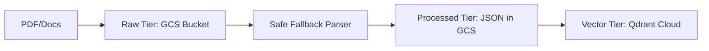

# 📥 02. Ingestion Engine

Documentation for the 3-Tier storage and processing pipeline.

## 🔄 3-Tier Storage Flow

### 💎 Tier Details
1. **RAW**: Original files in `rag-data-raw`.
2. **PROCESSED**: Structured text in `rag-data-processed`.
3. **VECTOR**: Embeddings in Qdrant.
