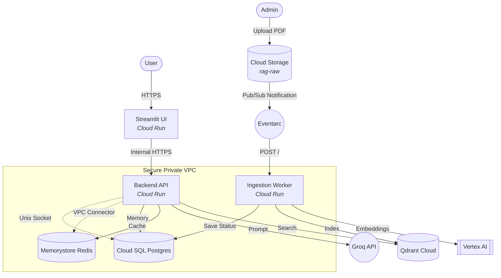

# ☁️ Google Cloud Infrastructure & Architecture

This document explains the transition from a "Normal RAG" to an **Enterprise Scalable RAG**, the GCP services involved, and how they interact to provide a production-grade system.

---

## 📈 From "Normal" to "Enterprise Scalable" RAG

A **Normal RAG** is usually a single script or a basic API that handles everything (parsing, embedding, and chatting) in one place. While it works for a few documents, it fails when:
1.  Thousands of users chat simultaneously.
2.  Gigabytes of new documents are uploaded every hour.
3.  The infrastructure needs to be rebuilt in a new region.

**Enterprise Scalable RAG** solves this through:
*   **Decoupling**: Separating the "Chatting" from the "Ingestion."
*   **Serverless (Cloud Run)**: Instances scale up instantly when traffic hits and scale to zero when idle (cost-saving).
*   **Event-Driven (Eventarc)**: Documents are processed as soon as they touch the bucket—no manual scripts.
*   **IaC (Terraform)**: The entire cloud environment is defined as code, making it 100% reproducible.

---

## 🏗️ Architecture Diagram

The diagram below illustrates how each service is connected via secure networking and event triggers.

---

## 🛠️ Service Breakdown

### 1. Cloud Run (Compute)
*   **Role:** Hosts our Backend API, UI, and Ingestion Worker.
*   **Why:** It is **Serverless**, meaning it only runs when needed and scales automatically to zero when idle. This significantly reduces costs while providing high availability.

### 2. Cloud Storage (GCS)
*   **Role:** Acts as our "Data Lake."
*   **Why:** It provides highly durable object storage. We use two buckets: one for **Raw** files (PDFs) and one for **Processed** metadata (JSON).

### 3. Eventarc (Event Orchestration)
*   **Role:** The "Glue" between Storage and Compute.
*   **Why:** It allows for an **Event-Driven Architecture**. Instead of our code constantly checking the bucket for new files, Eventarc "wakes up" the Ingestion Worker only when a new file is actually uploaded.

### 4. Cloud SQL (PostgreSQL)
*   **Role:** Persistent Conversation Memory.
*   **Why:** LangGraph requires a "checkpointer" to save the state of conversation threads. We use a managed Postgres instance for reliability and automatic backups.

### 5. Memorystore (Redis)
*   **Role:** Semantic Cache.
*   **Why:** To reduce LLM costs and latency, we cache common answers. Redis is an extremely fast in-memory database perfectly suited for this high-speed lookup.

### 6. Vertex AI
*   **Role:** High-Performance Embeddings.
*   **Why:** We use Google's `text-embedding-004` model to convert text chunks into numerical vectors. It offers state-of-the-art precision for enterprise retrieval.

### 7. Serverless VPC Access (Networking)
*   **Role:** Secure Internal Bridge.
*   **Why:** To ensure our data never leaves the private Google network, we use a VPC Connector. This allows our Cloud Run services to talk directly to Cloud SQL and Redis without using public IP addresses.

---

## 🔐 IAM Roles & Permissions

To make this architecture secure, we use **Least Privilege** service accounts:

| Service Account | Role | Purpose |
| :--- | :--- | :--- |
| `backend-sa` | `Cloud SQL Client` | Connect to Postgres memory. |
| `backend-sa` | `Vertex AI User` | Generate embeddings for search queries. |
| `ingestion-sa` | `Storage Object Viewer` | Read new files from GCS. |
| `ingestion-sa` | `Storage Object Creator` | Save processed JSON to the results bucket. |
| `eventarc-sa` | `Eventarc Event Receiver` | Authorized to trigger the Ingestion Worker. |

---
*Built with Security and Scalability in mind.*
