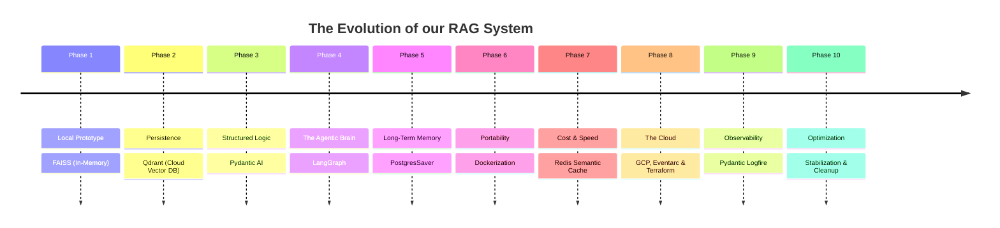

# 🚀 Our Epic Development Journey

Building this Enterprise Agentic RAG system wasn't a straight line. It was a journey of solving one bottleneck, only to discover the next challenge as we scaled. Here is the complete story of how we evolved from a tiny script on a laptop to a massive cloud architecture.

---

## Phase 1: The Local Prototype (FAISS)
**The Goal:** Build a simple AI that can read a document and answer questions about it.
**What we did:** We used **FAISS** (Facebook AI Similarity Search), a tool that stores vector embeddings directly in the computer's RAM.
**The Problem:** Because FAISS lives in RAM, every time we stopped the Python script, all the data vanished. If we uploaded a 50-page PDF, we had to re-process it every single time we turned the app on. It was completely unscalable.

## Phase 2: Persistent Storage (Qdrant)
**The Goal:** Make the data permanent.
**What we did:** We moved our data out of RAM and into **Qdrant**, a dedicated Vector Database hosted in the cloud. 
**The Win:** Now, we could upload a thousand documents, turn our computer off, turn it back on, and the AI could still instantly answer questions about them. The database became independent of the application.

## Phase 3: Structured Logic (Pydantic AI)
**The Goal:** Stop the LLM from generating messy, unpredictable text.
**What we did:** We introduced **Pydantic AI**. LLMs naturally want to talk like humans (e.g., "Sure, here is your answer..."). Pydantic forced the LLM to output strictly formatted data (like JSON). This meant our code wouldn't crash trying to read the LLM's response.

## Phase 4: The Agentic Leap (LangGraph)
**The Goal:** Make the AI "think" before it acts.
**What we did:** Standard RAG is dumb: it searches the database for *every* question, even if you just say "Hello". We integrated **LangGraph** to give the AI a brain.
* We created a **Planner**. If you say "Hello", the Planner just says "Hello" back without wasting time searching the database. If you ask a complex question, the Planner routes it to the **Retriever** to fetch facts.

## Phase 5: Long-Term Memory (Postgres)
**The Goal:** Allow users to have continuous conversations without the AI forgetting the previous message.
**What we did:** LLMs have "amnesia." Every question is treated as the first question ever asked. We attached a **PostgreSQL** database to LangGraph. Now, when User A asks a question, LangGraph saves the conversation in Postgres. When User A asks a follow-up question, LangGraph retrieves the history from Postgres, so the AI remembers context!

## Phase 6: Dockerization
**The Goal:** Make the app run perfectly on any computer or server.
**What we did:** "It works on my machine" is a classic developer problem. We wrapped our code, Python versions, and libraries into **Docker Containers**. Think of Docker like a shipping container: it seals the app inside a box so it can be shipped to any server in the world and run exactly the same way.

## Phase 7: Performance & Cost Savings (Redis)
**The Goal:** Stop paying for the same answer twice.
**What we did:** LLM API calls cost money and take 3-5 seconds. We added **Redis Semantic Caching**. If User A asks "What is the return policy?", the AI takes 5 seconds to answer. The answer is saved in Redis. If User B asks "Can I return this item?" (a semantically similar question), Redis intercepts the question and instantly hands back the saved answer in 0.05 seconds. No LLM required!

## Phase 8: The Cloud Infrastructure (GCP & Terraform)
**The Goal:** Put the app on the internet so millions can use it.
**What we did:** We used **Terraform** to write code that automatically built servers on Google Cloud. We deployed our Docker containers to **Cloud Run** (which automatically adds more servers if traffic spikes). We also added **Eventarc**, meaning if a user uploads a PDF, the cloud automatically wakes up a worker to process it without human intervention.

## Phase 9: Observability (Logfire)
**The Goal:** Know exactly what goes wrong when the app crashes in the cloud.
**What we did:** We added **Pydantic Logfire**. It acts as an X-Ray. If a user complains "The AI is slow!", we can look at Logfire and see exactly which step (the database search, the LLM thinking, or the UI) took the longest time.

## Phase 10: Optimization & Stabilization
**The Goal:** Clean up the codebase and ensure 100% reliability in production.
**What we did:** As the project grew, we accumulated "legacy" code and environment configuration debt. We performed a major overhaul:
*   **Legacy Cleanup:** Removed all outdated FAISS scripts and redundant ingestion pipelines to reduce codebase noise.
*   **Config Stabilization:** Fixed critical bugs where GCP environment variables (Project ID, Buckets, etc.) weren't reaching the cloud services correctly.
*   **Advanced Tracing:** Fully integrated **LangSmith** to provide deep, agentic-level tracing of every decision the AI makes, from planning to final response synthesis.
