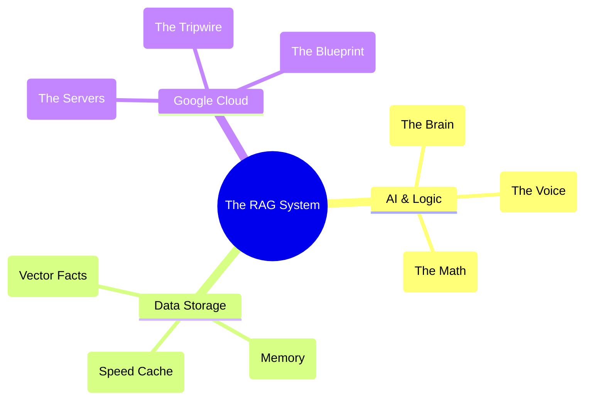

# 📖 RAG & Cloud Terminologies (Explained Simply)

Tech jargon can be overwhelming. Here is a simple, analogy-based dictionary to help you understand how all these buzzwords fit together.

## AI & Data Concepts

### RAG (Retrieval-Augmented Generation)
* **What it is:** AI models are smart, but they don't know your private company data. RAG is the process of forcing the AI to read a specific document *before* it answers your question.
* **Analogy:** It's like giving a student an open-book test instead of making them answer from memory.

### Vector Embeddings (Vertex AI)
* **What it is:** A way to translate English words into a list of hundreds of numbers.
* **Analogy:** Imagine a giant 3D map. The word "Dog" is placed near the word "Cat", but very far from the word "Car". Computers can't read words, but they are incredibly fast at calculating distances on a map.

### Agentic AI vs Standard AI
* **What it is:** A standard AI just spits out an answer. An "Agentic" AI has a workflow loop. It can plan, decide it needs more information, run a search, read the results, and *then* answer.
* **Analogy:** Standard AI is a fast-food worker reading a script. Agentic AI is a detective actively investigating a case.

## The Software Frameworks

### LangGraph
* **What it is:** The library we use to build the "Detective" workflow mentioned above. It lets us draw a flow-chart of logic (Nodes and Edges) that the AI must follow.

### FastAPI & Streamlit
* **FastAPI:** The invisible engine. It receives web requests, processes data instantly, and spits back raw text.
* **Streamlit:** The visible paint. It creates the pretty buttons, text boxes, and chat bubbles on the screen.

## Cloud Infrastructure

### Docker & Containers
* **What it is:** A technology that locks your code and its required Python version inside a virtual "box" (container).
* **Analogy:** If you bake a cake, it might taste different in a different oven. Docker ensures your cake comes with its exact oven included, so it tastes perfect no matter where it goes.

### Eventarc
* **What it is:** Google Cloud's alarm system.
* **Analogy:** Instead of paying a worker to sit around and constantly ask, "Are there new PDFs yet? Are there new PDFs yet?", Eventarc waits silently. The moment a PDF drops into the bucket, it rings an alarm to wake the worker up.

### Logfire (Observability)
* **What it is:** A tool that tracks exactly what the code is doing in real-time.
* **Analogy:** It's an X-Ray machine for the software. If the app is acting slow, Logfire shows us exactly which organ (the database, the AI, or the network) is causing the delay.
