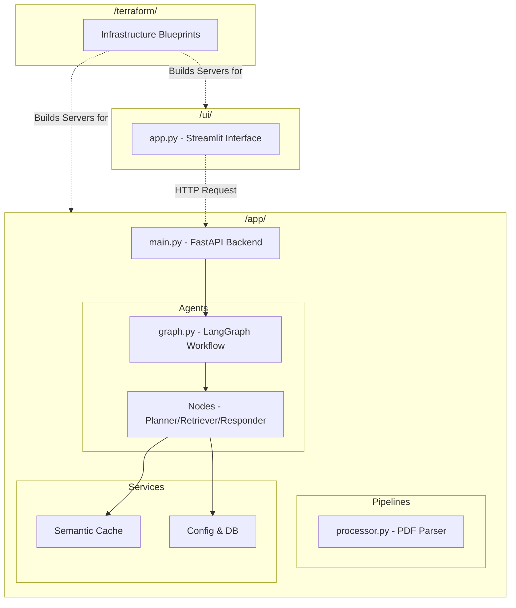

# 📂 Code Structure: How Everything Connects

Our codebase is strictly organized to separate concerns. This means a developer working on the UI doesn't accidentally break the Database connection.

Here is how the main components physically relate to each other:

## Folder Deep Dive

### 1. The `app/` Directory (Core Logic)
This is the heart of the system.
* `agents/`: Contains the LangGraph intelligence. The `graph.py` file is the master flow-chart. The `nodes/` folder contains the individual Python files for each step of the flow.
* `pipelines/`: Contains the heavy lifting workers. Currently, it holds the `ingestion` logic that Unstructured.io uses to break PDFs into chunks.
* `services/`: Reusable tools. The `cache/` folder handles talking to Redis, and `core/` handles the database URLs and passwords.

### 2. The `ui/` Directory (Frontend)
Contains purely visual code. It has its own `requirements.txt` because Streamlit requires very different libraries than the deep AI backend.

### 3. The `docker/` Directory (Packaging)
Contains three `.Dockerfile` blueprints. These files literally read as instructions: "Start with a clean Linux computer, install Python 3.11, copy the `app` folder, and start the server on Port 8080."

### 4. The `terraform/` Directory (Cloud Building)
Contains the `.tf` files. If the `docker` folder builds the *software* boxes, the `terraform` folder builds the *hardware* highways, hard drives, and networks in Google Cloud.

### 5. `cloudbuild.yaml` (The Automation Master)
This is a Google Cloud specific file. It acts as a master script that automatically triggers the Docker builds whenever code is updated.
