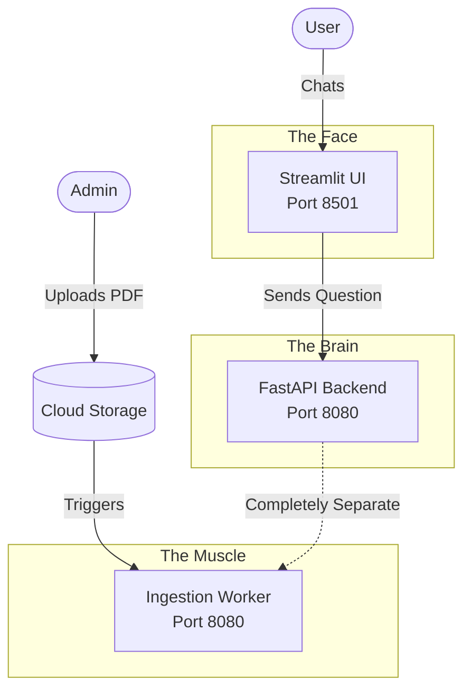

# 🧩 Microservices Architecture: A Deep Dive

When we first built this app, everything (the chat interface, the AI thinking, and the PDF processing) was crammed into one single Python file. This is called a **Monolith**.

While a Monolith is easy to write, it fails in the real world. 

## The Problem with Monoliths
Imagine if your app becomes popular. User A is chatting with the AI. At the exact same time, User B uploads a massive 1,000-page PDF of legal documents. 
Because everything is in one script, the server devotes 100% of its brainpower to reading that massive PDF. User A's chat freezes. The AI stops responding. The app crashes.

## The Solution: Microservices
To prevent this, we took an axe to our code and chopped it into three independent mini-applications (Microservices). 

### 1. The UI Service (The Face)
* **What it is:** The visual website built with Streamlit.
* **Why we made it:** Streamlit is amazing for fast UI development, but it handles network traffic very weirdly (it constantly re-runs the entire Python script every time you click a button). By isolating the UI into its own service, we ensure its weird quirks don't mess up our core AI logic.
* **How to use it:** Users simply go to the URL. The UI's only job is to draw the chat bubbles and send the text to the Backend.

### 2. The Backend Service (The Brain)
* **What it is:** A blazing-fast FastAPI server hosting our LangGraph AI.
* **Why we made it:** This is the core intelligence. It needs to be lightweight so it can answer questions in milliseconds. It does NOT process PDFs. It only receives a question, thinks, searches the database, and returns the text. 
* **Scaling Benefit:** If 10,000 people open the chat at once, Google Cloud will automatically clone this "Brain" service 100 times to handle the chat traffic, without wasting money cloning the PDF processing logic.

### 3. The Ingestion Service (The Muscle)
* **What it is:** A background worker running invisibly in the cloud.
* **Why we made it:** Processing PDFs, cutting them into chunks, and running them through AI models to create "embeddings" is extremely heavy work. This service does nothing but lift heavy weights.
* **Scaling Benefit:** If no one uploads a PDF for a month, this service scales down to Zero. You pay $0.00. But if an admin uploads 50 PDFs at once, it instantly wakes up, processes them in the background, and goes back to sleep, never once slowing down the chatting users.
