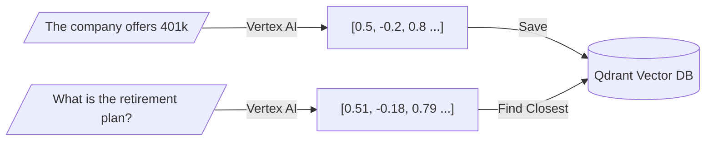
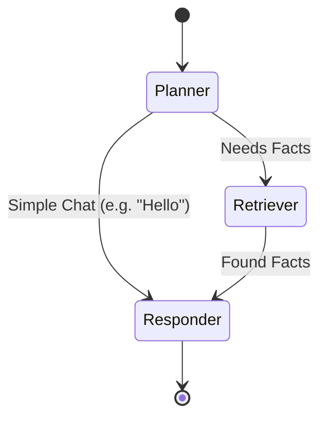
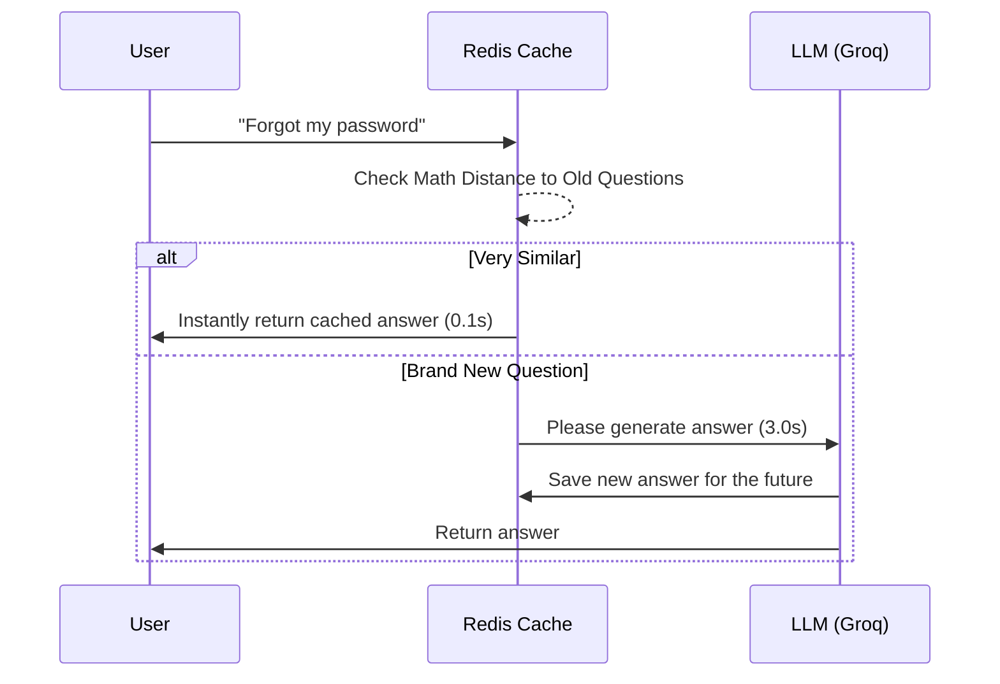

# 🔬 Component Deep Dive (Explained Simply)

This document breaks down the complex "magic" happening under the hood of our RAG system into simple, easy-to-understand concepts.

---

## 1. Vector Search (How the AI "Reads")
Computers don't understand English. If you search for "puppy", a standard database will only look for the exact letters P-U-P-P-Y. If the document says "young dog", a standard database finds nothing.

**The Solution: Embeddings & Qdrant**
We use an AI model (Vertex AI) to turn sentences into "Coordinates" on a massive map. 
* "Puppy" might be placed at coordinates `[1.2, 4.5]`. 
* "Young dog" is placed at `[1.3, 4.4]`. 

Because they mean the same thing, their coordinates are mathematically very close together on the map. 
**Qdrant** is the database that holds all these coordinates. When you ask a question, we turn your question into coordinates, drop it on the map, and Qdrant draws a circle around it to find the closest facts!

---

## 2. LangGraph Agent (How the AI "Thinks")
Standard chatbots are linear: you ask, they answer. Our LangGraph Agent is a state machine that loops through decision nodes.

1. **The Planner:** This is the manager. If you say "Hi", the manager says "I don't need to search the database for this," and routes you directly to the Responder to say "Hello back."
2. **The Retriever:** If the manager decides you need facts, it sends your query here. The Retriever talks to Qdrant to pull the data.
3. **The Responder:** The final writer. It takes the facts from the Retriever, looks at your question, and writes a beautifully formatted answer.

---

## 3. Postgres Memory (How the AI "Remembers")
If you ask the AI, "What is the capital of France?", it says "Paris."
If your next question is, "What is the population *there*?", the AI needs to know that "there" means Paris.

**How we built it:**
We attached a **PostgreSQL** database. Every time you open the chat, we generate a random `thread_id` (like `User-123`). 
Before LangGraph starts thinking, it goes to Postgres, says "Give me all the past messages for User-123", and injects them into the AI's brain. Now the AI knows exactly what you were talking about 10 minutes ago.

---

## 4. Semantic Caching (How the AI "Saves Money")
Every time the AI thinks, we pay Google/Groq a fraction of a cent, and the user has to wait 3 seconds.

We added **RedisVL**. Redis is a lightning-fast cache.
When a user asks a question, Redis mathematically compares the question to *every question anyone has ever asked before*.
If someone previously asked "How do I reset my password?", and you ask "Forgot my password, what do I do?", Redis realizes the mathematical meaning is 99% identical. It stops the AI from turning on, and instantly hands you the old answer.

