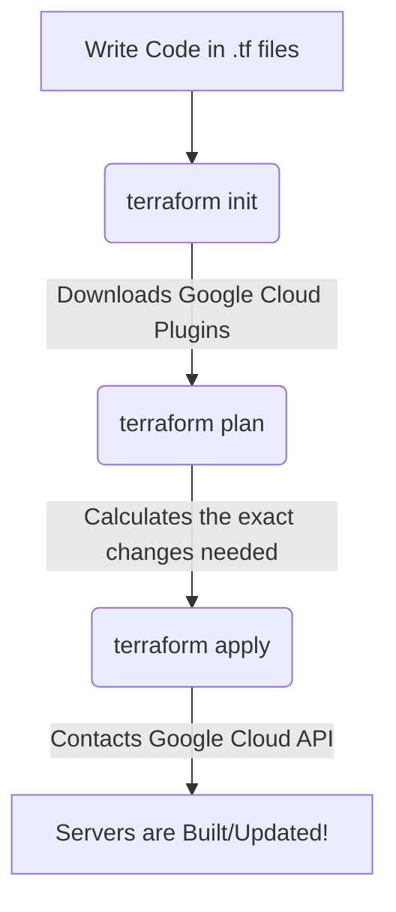

# 🏗️ Terraform Guide (Infrastructure as Code)

## What is Terraform?
Imagine you want to build a house. You could go buy bricks and build it yourself by hand (Manual). Or, you could hand a blueprint to a robot factory, and the factory perfectly builds the house in 5 seconds (Terraform).

Terraform is a tool that allows us to write **Infrastructure as Code (IaC)**. Instead of logging into the Google Cloud website and manually clicking 50 buttons to create a database, we write a text file (`.tf`) that says exactly what we want.

## Why are we using it?
1. **No Human Error:** If you manually click buttons, you might forget to click a security checkbox. Terraform never forgets.
2. **Instant Replication:** Want to create a duplicate "Staging" environment to test new features safely? With Terraform, you just change the project name and press enter. It builds an exact replica in minutes.
3. **Self-Documenting:** The Terraform code *is* the documentation of our cloud network.

## The Terraform Pipeline
When we want to update our servers, we run three simple commands.

1. **`terraform init`**: Prepares the workspace. It's like turning the robot factory on.
2. **`terraform plan`**: The "Dry Run". Terraform looks at your Google Cloud account, compares it to your code, and says: *"I noticed you want a new Redis Cache. I will create 1 new resource."* It asks for your permission.
3. **`terraform apply`**: Executes the plan. It talks to Google's APIs and physically allocates the servers, networks, and databases.

## Understanding the "State File"
How does Terraform know what already exists in your cloud? 
When Terraform runs, it creates a secret file called `terraform.tfstate`. This file is the "Memory" of Terraform. If you delete a line of code for a database, Terraform looks at the state file, realizes the database used to exist, and reaches into Google Cloud to destroy it.

## Our Terraform Code Structure
We organized our blueprints into logical files:
* `main.tf`: The foundation. Creates the VPC (Private Network), Redis Cache, and IAM (Security Permissions).
* `cloud_run.tf`: Defines the rules for our Docker containers (How much RAM they get, what port they listen on).
* `database.tf`: Builds the Postgres SQL database.
* `ingestion.tf`: Creates the Eventarc trigger (The "Tripwire" that wakes up the ingestion worker when a file drops).

---

## 🧹 The "Clean Sweep" Checklist (Crucial!)
Terraform wants to be the **sole owner** of your infrastructure. Before your first run, ensure these names are NOT already used manually in your GCP Console:
*   **VPC Network**: `rag-vpc`
*   **VPC Connector**: `rag-connector`
*   **Artifact Repo**: `enterprise-rag-repo`
*   **Cloud SQL**: `enterprise-rag-db`

## 🎯 The "Targeted Apply" Strategy
Sometimes we have a "Chicken and Egg" problem (e.g., the code needs a Repository to exist before it can be built). Use this professional trick:

1.  **Build the Repository first:**
    `terraform apply -target=google_artifact_registry_repository.repo`
2.  **Run your Cloud Build** to push the images.
3.  **Run a full apply** to finish everything:
    `terraform apply`
