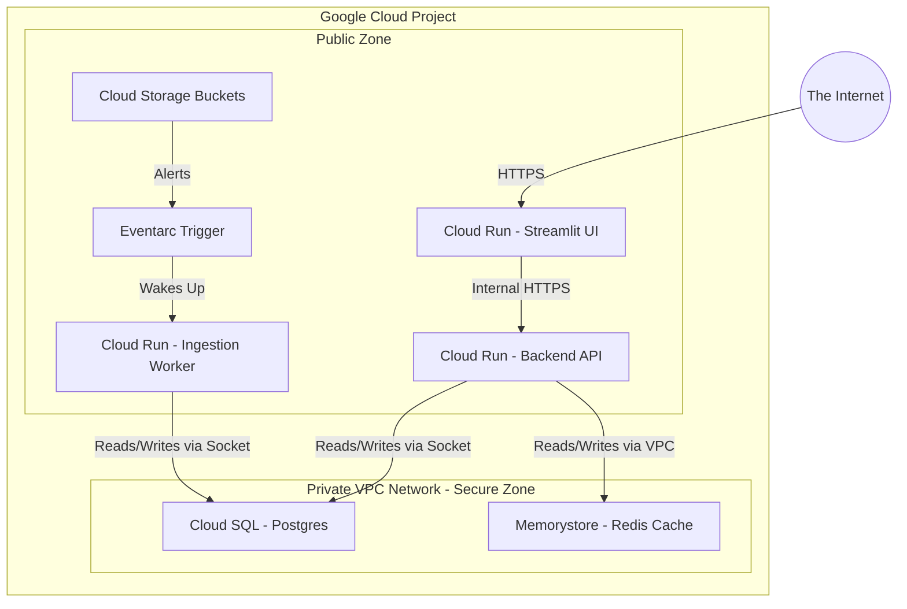

# ☁️ Google Cloud Services: A Visual Guide

We utilize a wide array of Google Cloud Platform (GCP) services to make this application highly scalable and secure.

## The Google Cloud Network Topology

---

## Service Breakdown & Manual Activation

### 1. Serverless VPC Access (The Secure Highway)
* **What it is:** By default, Cloud Run is on the public internet, and Redis is hidden deep in a secure private network. A VPC Access Connector acts as a secure tunnel allowing Cloud Run to reach Redis without exposing Redis to hackers.
* **Why we use it:** Absolute requirement for Semantic Caching.
* **Manual Setup:** Search *Serverless VPC Access API* -> Enable. Go to VPC Network -> Serverless VPC access -> Create Connector.

### 2. Cloud Run (The Autoscaling Servers)
* **What it is:** Google's premier serverless container platform.
* **Why we use it:** If you have zero users, it shuts down the servers and charges you $0. If your app goes viral, it spins up 1,000 servers in milliseconds.
* **Manual Setup:** Search *Cloud Run* -> Create Service -> Select your Docker image -> Set Port to 8080 (or 8501 for Streamlit).

### 3. Eventarc (The Tripwire)
* **What it is:** An event-routing system.
* **Why we use it:** To automate data ingestion. Instead of a user having to click a button to process a PDF, Eventarc automatically triggers the code the second the PDF finishes uploading.
* **Manual Setup:** Search *Eventarc* -> Create Trigger -> Set Event Provider to *Cloud Storage* -> Set Target to your *Cloud Run Ingestion Service*.

### 4. Cloud SQL (PostgreSQL)
* **What it is:** A fully managed, enterprise-grade relational database.
* **Why we use it:** To store LangGraph's complex conversation threads so users can resume chats days later.
* **Manual Setup:** Search *SQL* -> Create Instance -> Select PostgreSQL. (Note: Cloud Run connects to this via a special "Unix Socket" volume mount, bypassing the need for IP addresses).

### 5. Memorystore (Redis)
* **What it is:** An ultra-fast, in-memory cache database.
* **Why we use it:** It powers our Semantic Cache. It can retrieve previously generated LLM answers in under a millisecond, saving massive amounts of money on LLM API bills.
* **Manual Setup:** Search *Memorystore* -> Create Instance -> Choose Redis -> Attach to your VPC Network.

### 6. Document AI (The PDF Genius)
* **What it is:** Google's AI-powered OCR and document understanding service.
* **Why we use it:** Instead of using slow local libraries, we offload PDF parsing to Google. It handles complex tables and multi-column layouts with extreme accuracy.
* **Setup:** Create a *Custom Document Extractor* processor in the Console.

### 7. Artifact Registry (The Image Warehouse)
* **What it is:** A secure, private place to store Docker container images.
* **Why we use it:** Cloud Run needs a place to "pull" your code from. This registry acts as the secure bridge between your code and your servers.
