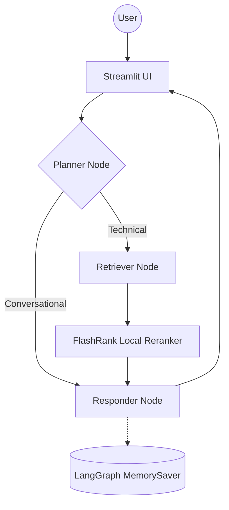

# 🤖 Enterprise Agentic RAG (Scalable Pipeline)

A production-grade, cyclic RAG system built with **LangGraph**, **Google Cloud Platform (GCP)**, and **Groq**. This system distinguishes between technical "True Data" and random "Noisy Data" using semantic re-ranking and history-aware planning.

## 🚀 Key Features
*   **Agentic Intelligence**: Uses LangGraph for complex, cyclic reasoning and multi-step planning.
*   **Enterprise Search**: Integration with **Qdrant Cloud** for high-performance vector search and **FlashRank** for ultra-fast local semantic reranking.
*   **Observability**: Full tracing with **Pydantic Logfire** and **LangSmith** for real-time monitoring of agent decisions.
*   **Scalable Infrastructure**: Deployed on **Google Cloud Run** with **Cloud Build** CI/CD and **VPC Connectors** for private networking.
*   **Document Intelligence**: Uses **Google Document AI** for high-fidelity PDF parsing and data extraction.

---

## 🔄 Agent Intelligence Flow


---

## 📂 Project Structure
```text
├── app/
│   ├── agents/          # LangGraph Nodes, State, and Graph compilation
│   ├── config.py        # Centralized environment variable management
│   ├── ingestion/       # End-to-end data processing (Loaders, Chunking)
│   ├── main.py          # FastAPI application entrypoint
│   ├── services/
│   │   ├── retrieval/   # Vector search (Qdrant), Embeddings (Vertex), Ranking (FlashRank)
│   │   └── storage/     # Postgres Checkpointers and Redis Cache
├── ui/                  # Streamlit interface with source transparency & reasoning steps
├── DOCS/                # Comprehensive architectural and operational documentation
├── DATA/                # Sample datasets (True vs Noisy documentation)
├── Dockerfile           # Optimized production container definition
└── requirements.txt     # Locked dependencies for local and cloud parity
```

---

## 🏗️ Tech Stack
*   **Orchestration**: LangChain & LangGraph
*   **LLMs**: Groq (Llama 3.3 70B) for lightning-fast reasoning
*   **Vector DB**: Qdrant (Cloud)
*   **Cloud Platform**: Google Cloud Platform
    *   **Compute**: Cloud Run (Serverless)
    *   **Storage**: Cloud Storage (GCS)
    *   **Database**: Cloud SQL (Postgres) & Redis
    *   **AI Services**: Vertex AI (Embeddings), FlashRank (Local Reranking), Document AI
*   **Observability**: Logfire (OpenTelemetry) & LangSmith

---

## 📚 Documentation Index
All detailed guides are located in the [DOCS/](DOCS/) folder:

1.  **[System Overview](DOCS/01_SYSTEM_OVERVIEW.md)** - High-level vision and system flow.
2.  **[Ingestion Engine](DOCS/02_INGESTION_ENGINE.md)** - How documents are parsed and indexed.
3.  **[Node Intelligence](DOCS/03_NODE_INTELLIGENCE.md)** - The "Brain" (Planner, Retriever, Responder).
4.  **[Observability](DOCS/04_TRACING_AND_OBSERVABILITY.md)** - Logfire and LangSmith tracing.
5.  **[GCP Prod Setup](DOCS/05_GCP_PROD_SETUP.md)** - Step-by-step infrastructure provisioning.
6.  **[Deployment Strategy](DOCS/06_DEPLOYMENT_STRATEGY.md)** - Cloud Build and Cloud Run details.
7.  **[Env Variables](DOCS/07_ENVIRONMENT_VARIABLES.md)** - Complete configuration dictionary.
8.  **[GCP Roles & Services](DOCS/08_GCP_ROLES_AND_SERVICES.md)** - IAM and service breakdown.
9.  **[Infra Architecture](DOCS/09_INFRA_ARCHITECTURE.md)** - The 3-tier cloud blueprint.
10. **[Known Gotchas](DOCS/12_KNOWN_GOTCHAS.md)** - GCP quirks and architectural decisions.

---

## 🛠️ Getting Started

1.  **Clone & Install**:
    ```bash
    pip install -r requirements.txt
    ```
2.  **Configure**:
    Copy `commands.md.example` to `commands.md` and fill in your keys.
3.  **Run Ingestion**:
    ```bash
    python -m app.ingestion.processor DATA --wipe
    ```
4.  **Launch App**:
    ```bash
    uvicorn app.main:app --port 8000 & streamlit run ui/app.py
    ```

---
*Built for High-Scale Enterprise Document Intelligence.*
